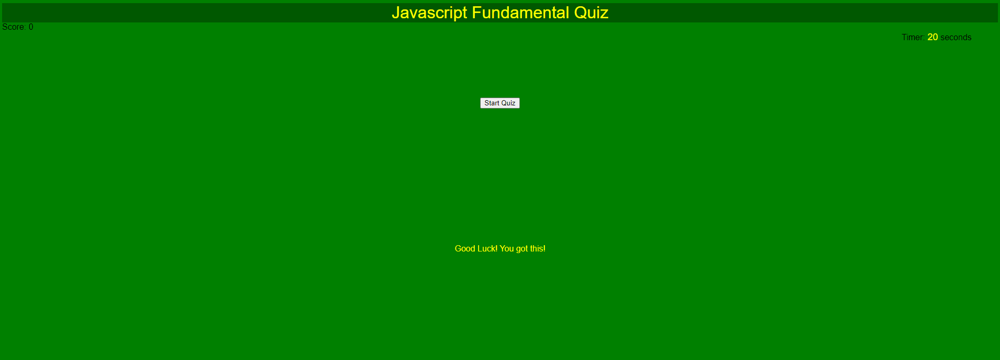
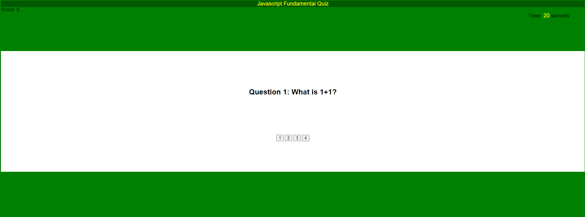
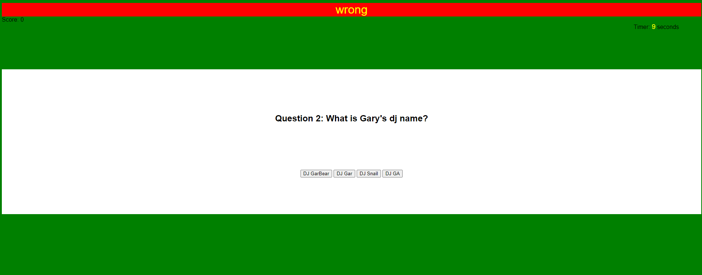
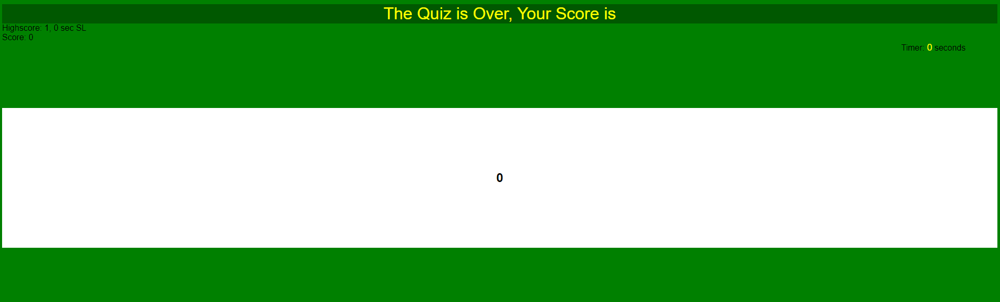
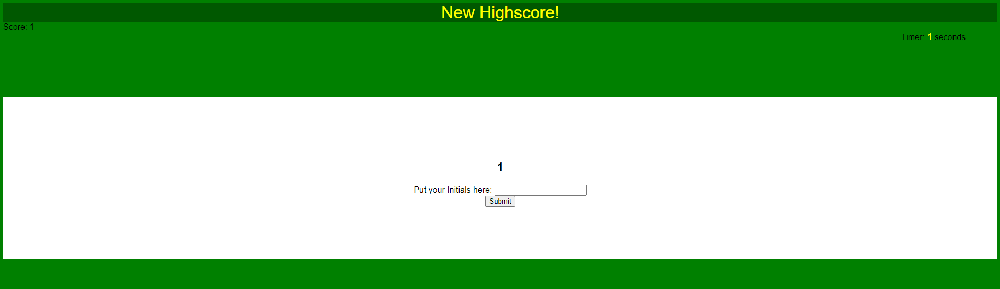
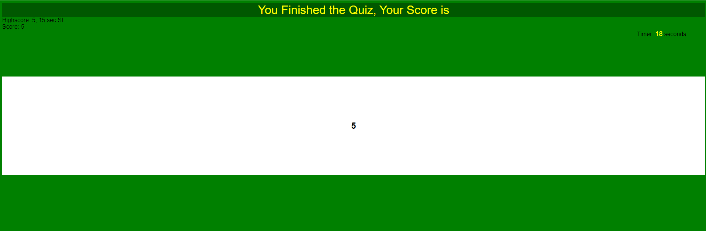
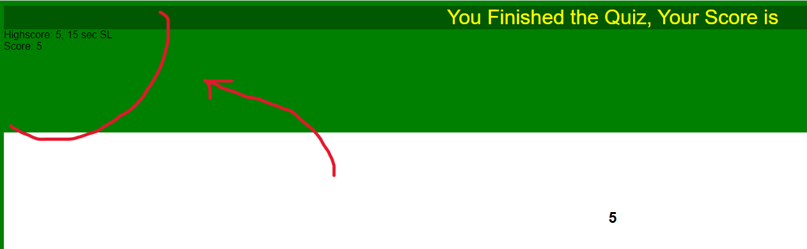

# The Quizler

## Description

The Quizler is a mock up timed quiz.
 - My motive for this project was to make a working quiz page that allowed the user to take a quiz. 
 - I built this project to learn more about JavaScript and to play around with more JavaScript, in which when I write a bad code, allows me to learn from it and get a better code.
 - This can be used to give quiz to students or others who you want to take the quiz. Wmaller functions such as the codes for the buttons and sush, could be used for other purpose when applied correctly.
 - I've learned now to use sets of complicated arrays or group of objects with properties.
 - I've also learned more codes for buttons and how to save something to the local storage and pull things from it.

## Usage

When the page is loaded up:
 - it has a background of gree to motivate focus.
 - it has a title to tell the user what it is.
 - it has a section that displays the score as the user goes through the quiz.
 - it has a section that displays the time as the user goes through the quiz.
 - it has a button that allows the user to start the quiz.
 - it has a footer to encourage the user.

When the button is clicked: 
 - the button disappears
 - the title shrinks
 - the timer starts
 - the footer disappears
 - a part of the background turns white
 - the question appears
 - the options appears

When the wrong option is clicked:
 - five seconds is taken off of the timer
 - then it goes to the next question
 - the title background turns red
 - the title text turns into "wrong"

When the correct option is clicked:
 - one score is added to your score
 - then it goes to the next question
 - title is reset to normal

When the timer runs out:
 - the title text turns into "The Quiz is Over, Your Score is"
 - the score is displayed on the screen

If the timer runs out, but there is no highscore in your localstorage or your score is bigger then the current highscore:
 - the title turns into "New Highscore!"
 - a text appears that says "Put your initials here:"
 - a textbox appears 
 - a submit button appears

When The quiz is done:
 - the title text turns into "You Finished the Quiz, Your Score is"
 - the score is displayed on the screen

If the quiz is done, but there is no highscore in your localstorage or your score is bigger then the current highscore:
 - the title turns into "New Highscore!"
 - a text appears that says "Put your initials here:"
 - a textbox appears 
 - a submit button appears

When the submit button is clicked:
 - the score, time, and initials is submited into the localstorage

If the localstorage has a previous score:
 - the score, time, and initial is displayed

## credits

On this project, I mostly worked on my own as I wanted to explore JavaScript more. My starting phase was slow for I knew very little even after all the classes, but after throwing code on the screen, I slowly figured out what I needed to do. I am very proud that I had done most of the coding by myself.

besides my own work I had some help from:

Gary Almes - The Instructer

Arthur Henningfield - https://github.com/kylatae

Joey Thao - https://github.com/Thaodev23

Jason Yang - https://github.com/Jasony95

If it was not for the help and support from the people listed above I would have been stuck on things that I don't know or that I can't figure out. 